# AstrBot 机器人项目后端架构分析

## 1. 项目概述

AstrBot 是一个基于 Python 的多平台聊天机器人框架，采用事件驱动的异步架构设计。该项目支持多种聊天平台（QQ、微信、Telegram、Discord等），集成多种AI服务提供商，并提供了灵活的插件系统。

### 1.1 核心特性

- **多平台支持**：支持QQ、微信、Telegram、Discord、飞书等多个聊天平台
- **多AI提供商**：集成OpenAI、Claude、智谱AI、通义千问等多种AI服务
- **插件系统**：基于Star架构的灵活插件系统
- **事件驱动**：采用异步事件总线架构
- **流水线处理**：消息处理采用洋葱模型的流水线架构
- **Web管理面板**：提供可视化的配置和管理界面

## 2. 整体架构设计

### 2.1 架构层次图

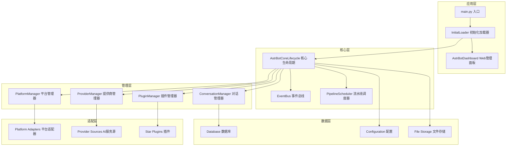
```mermaid
graph TB
    subgraph "应用层"
        A[main.py 入口]
        B[InitialLoader 初始化加载器]
        C[AstrBotDashboard Web管理面板]
    end
    
    subgraph "核心层"
        D[AstrBotCoreLifecycle 核心生命周期]
        E[EventBus 事件总线]
        F[PipelineScheduler 流水线调度器]
    end
    
    subgraph "管理层"
        G[PlatformManager 平台管理器]
        H[ProviderManager 提供商管理器]
        I[PluginManager 插件管理器]
        J[ConversationManager 对话管理器]
    end
    
    subgraph "适配层"
        K[Platform Adapters 平台适配器]
        L[Provider Sources AI服务源]
        M[Star Plugins 插件]
    end
    
    subgraph "数据层"
        N[Database 数据库]
        O[Configuration 配置]
        P[File Storage 文件存储]
    end
    
    A --> B
    B --> D
    B --> C
    D --> E
    D --> F
    D --> G
    D --> H
    D --> I
    D --> J
    G --> K
    H --> L
    I --> M
    J --> N
    D --> O
    D --> P
```

### 2.2 核心组件关系图

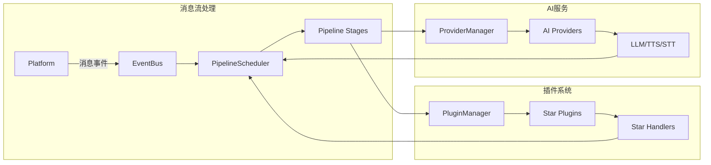
```mermaid
graph LR
    subgraph "消息流处理"
        A[Platform] -->|消息事件| B[EventBus]
        B --> C[PipelineScheduler]
        C --> D[Pipeline Stages]
    end
    
    subgraph "插件系统"
        E[PluginManager] --> F[Star Plugins]
        F --> G[Star Handlers]
    end
    
    subgraph "AI服务"
        H[ProviderManager] --> I[AI Providers]
        I --> J[LLM/TTS/STT]
    end
    
    D --> E
    D --> H
    G --> C
    J --> C
```

## 3. 核心模块详细分析

### 3.1 核心生命周期管理 (AstrBotCoreLifecycle)

核心生命周期管理类是整个系统的控制中心，负责协调所有组件的初始化、启动和停止。

#### 3.1.1 生命周期流程图

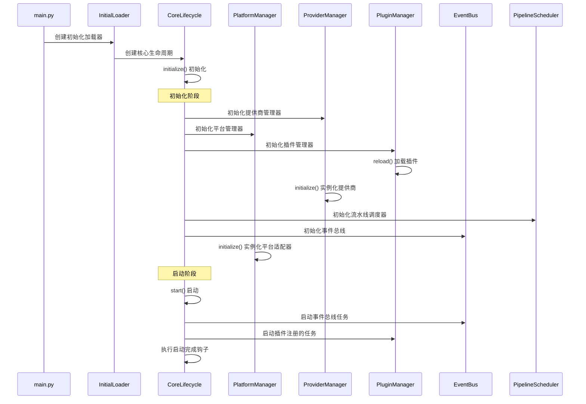
```mermaid
sequenceDiagram
    participant Main as main.py
    participant IL as InitialLoader
    participant CL as CoreLifecycle
    participant PM as PlatformManager
    participant PRM as ProviderManager
    participant PLM as PluginManager
    participant EB as EventBus
    participant PS as PipelineScheduler
    
    Main->>IL: 创建初始化加载器
    IL->>CL: 创建核心生命周期
    CL->>CL: initialize() 初始化
    
    Note over CL: 初始化阶段
    CL->>PRM: 初始化提供商管理器
    CL->>PM: 初始化平台管理器
    CL->>PLM: 初始化插件管理器
    PLM->>PLM: reload() 加载插件
    PRM->>PRM: initialize() 实例化提供商
    CL->>PS: 初始化流水线调度器
    CL->>EB: 初始化事件总线
    PM->>PM: initialize() 实例化平台适配器
    
    Note over CL: 启动阶段
    CL->>CL: start() 启动
    CL->>EB: 启动事件总线任务
    CL->>PLM: 启动插件注册的任务
    CL->>CL: 执行启动完成钩子
```

#### 3.1.2 组件初始化顺序

1. **事件队列初始化**：创建异步消息队列
2. **提供商管理器初始化**：加载AI服务提供商
3. **平台管理器初始化**：准备平台适配器
4. **对话管理器初始化**：初始化会话管理
5. **插件上下文初始化**：创建插件运行环境
6. **插件管理器初始化**：扫描和加载插件
7. **流水线调度器初始化**：准备消息处理流水线
8. **事件总线初始化**：启动事件分发机制
9. **平台适配器实例化**：启动各平台连接

### 3.2 事件总线系统 (EventBus)

事件总线是系统的消息分发中心，采用异步队列机制处理所有消息事件。

#### 3.2.1 事件处理流程

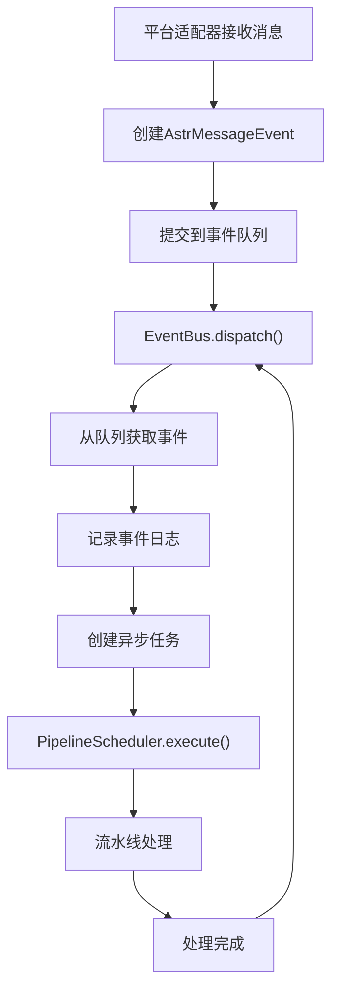
```mermaid
flowchart TD
    A["平台适配器接收消息"] --> B["创建AstrMessageEvent"]
    B --> C["提交到事件队列"]
    C --> D["EventBus.dispatch()"]
    D --> E["从队列获取事件"]
    E --> F["记录事件日志"]
    F --> G["创建异步任务"]
    G --> H["PipelineScheduler.execute()"]
    H --> I["流水线处理"]
    I --> J["处理完成"]
    J --> D
```

#### 3.2.2 事件总线特点

- **异步处理**：所有事件处理都是异步的，不会阻塞消息接收
- **任务隔离**：每个消息事件都在独立的异步任务中处理
- **错误隔离**：单个事件处理失败不会影响其他事件
- **日志记录**：自动记录所有事件的处理日志

### 3.3 流水线调度器 (PipelineScheduler)

流水线调度器实现了洋葱模型的消息处理架构，将消息处理分解为多个有序的阶段。

#### 3.3.1 流水线阶段结构

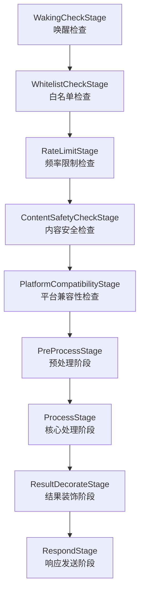
```mermaid
graph TD
    A[WakingCheckStage<br/>唤醒检查] --> B[WhitelistCheckStage<br/>白名单检查]
    B --> C[RateLimitStage<br/>频率限制检查]
    C --> D[ContentSafetyCheckStage<br/>内容安全检查]
    D --> E[PlatformCompatibilityStage<br/>平台兼容性检查]
    E --> F[PreProcessStage<br/>预处理阶段]
    F --> G[ProcessStage<br/>核心处理阶段]
    G --> H[ResultDecorateStage<br/>结果装饰阶段]
    H --> I[RespondStage<br/>响应发送阶段]
```

#### 3.3.2 洋葱模型实现

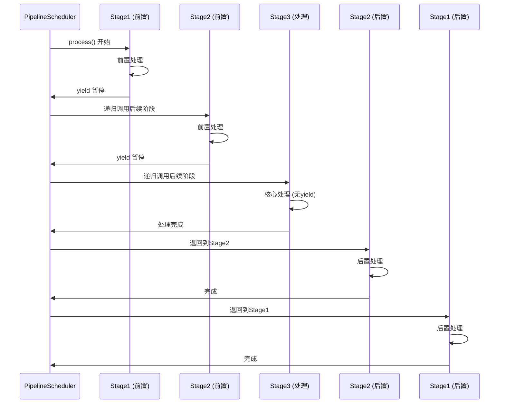
```mermaid
sequenceDiagram
    participant PS as PipelineScheduler
    participant S1 as Stage1 (前置)
    participant S2 as Stage2 (前置)
    participant S3 as Stage3 (处理)
    participant S2B as Stage2 (后置)
    participant S1B as Stage1 (后置)
    
    PS->>S1: process() 开始
    S1->>S1: 前置处理
    S1->>PS: yield 暂停
    PS->>S2: 递归调用后续阶段
    S2->>S2: 前置处理
    S2->>PS: yield 暂停
    PS->>S3: 递归调用后续阶段
    S3->>S3: 核心处理 (无yield)
    S3->>PS: 处理完成
    PS->>S2B: 返回到Stage2
    S2B->>S2B: 后置处理
    S2B->>PS: 完成
    PS->>S1B: 返回到Stage1
    S1B->>S1B: 后置处理
    S1B->>PS: 完成
```

#### 3.3.3 各阶段功能说明

| 阶段 | 功能 | 处理类型 |
|------|------|----------|
| WakingCheckStage | 检查消息是否需要唤醒机器人 | 过滤器 |
| WhitelistCheckStage | 检查用户/群组是否在白名单中 | 过滤器 |
| RateLimitStage | 检查消息频率是否超限 | 过滤器 |
| ContentSafetyCheckStage | 检查消息内容安全性 | 过滤器 |
| PlatformCompatibilityStage | 检查插件平台兼容性 | 过滤器 |
| PreProcessStage | 消息预处理和格式化 | 处理器 |
| ProcessStage | 插件处理和AI调用 | 核心处理器 |
| ResultDecorateStage | 结果装饰和格式化 | 处理器 |
| RespondStage | 发送响应消息 | 输出器 |

### 3.4 插件系统 (Star Architecture)

插件系统采用Star架构，提供了灵活的扩展机制。

#### 3.4.1 插件系统架构

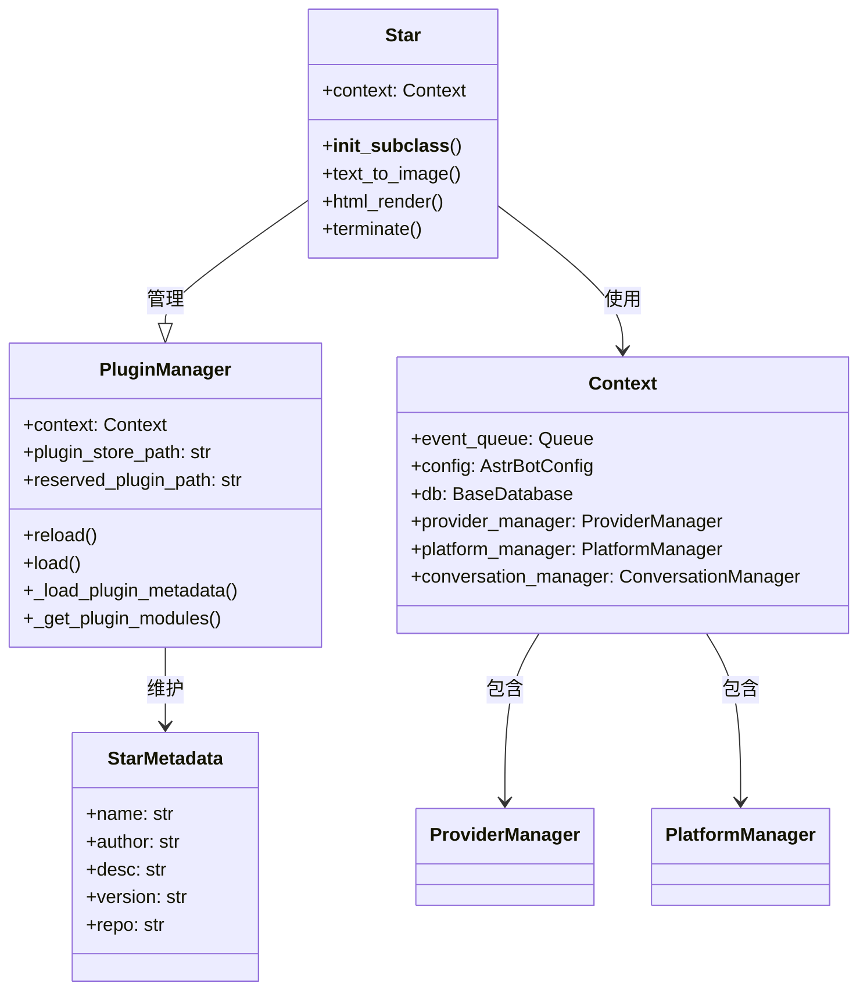
```mermaid
classDiagram
    class Star {
        +context: Context
        +__init_subclass__()
        +text_to_image()
        +html_render()
        +terminate()
    }
    
    class PluginManager {
        +context: Context
        +plugin_store_path: str
        +reserved_plugin_path: str
        +reload()
        +load()
        +_load_plugin_metadata()
        +_get_plugin_modules()
    }
    
    class Context {
        +event_queue: Queue
        +config: AstrBotConfig
        +db: BaseDatabase
        +provider_manager: ProviderManager
        +platform_manager: PlatformManager
        +conversation_manager: ConversationManager
    }
    
    class StarMetadata {
        +name: str
        +author: str
        +desc: str
        +version: str
        +repo: str
    }
    
    Star --|> PluginManager : 管理
    Star --> Context : 使用
    PluginManager --> StarMetadata : 维护
    Context --> ProviderManager : 包含
    Context --> PlatformManager : 包含
```

#### 3.4.2 插件加载流程

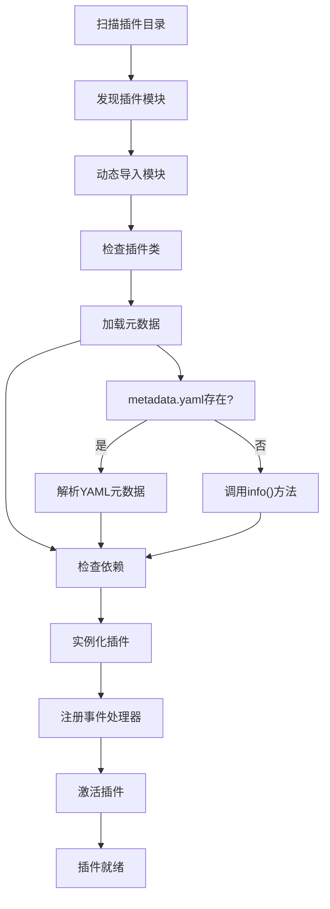
```mermaid
flowchart TD
    A["扫描插件目录"] --> B["发现插件模块"]
    B --> C["动态导入模块"]
    C --> D["检查插件类"]
    D --> E["加载元数据"]
    E --> F["检查依赖"]
    F --> G["实例化插件"]
    G --> H["注册事件处理器"]
    H --> I["激活插件"]
    I --> J["插件就绪"]
    
    E --> K["metadata.yaml存在?"]
    K -->|"是"| L["解析YAML元数据"]
    K -->|"否"| M["调用info()方法"]
    L --> F
    M --> F
```

#### 3.4.3 插件事件处理机制

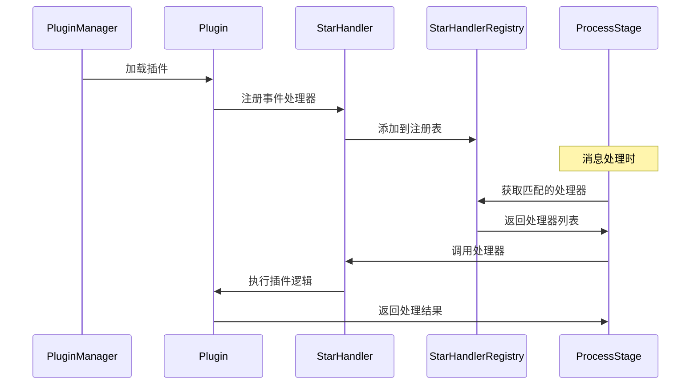
```mermaid
sequenceDiagram
    participant PM as PluginManager
    participant P as Plugin
    participant SH as StarHandler
    participant SHR as StarHandlerRegistry
    participant PS as ProcessStage
    
    PM->>P: 加载插件
    P->>SH: 注册事件处理器
    SH->>SHR: 添加到注册表
    
    Note over PS: 消息处理时
    PS->>SHR: 获取匹配的处理器
    SHR->>PS: 返回处理器列表
    PS->>SH: 调用处理器
    SH->>P: 执行插件逻辑
    P->>PS: 返回处理结果
```

### 3.5 平台管理器 (PlatformManager)

平台管理器负责管理多个聊天平台的适配器，实现统一的消息接口。

#### 3.5.1 平台适配器架构

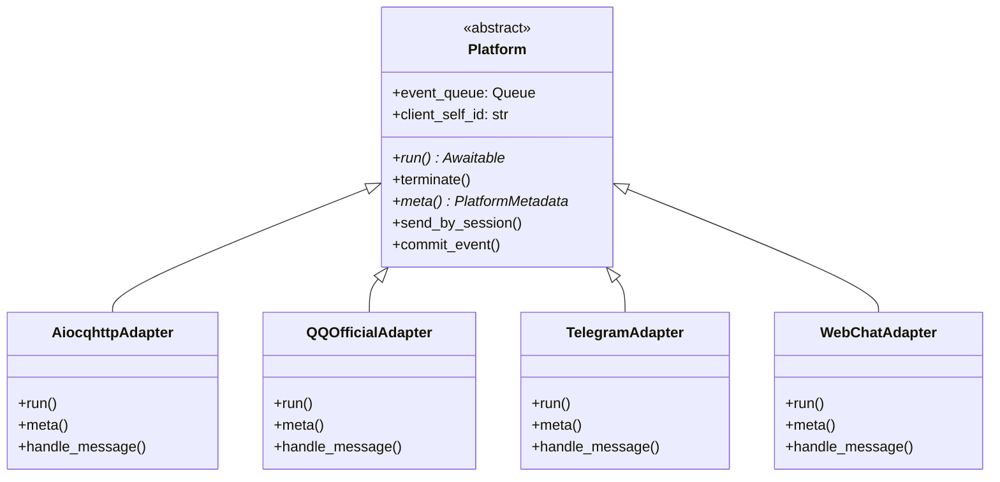
```mermaid
classDiagram
    class Platform {
        <<abstract>>
        +event_queue: Queue
        +client_self_id: str
        +run()* Awaitable
        +terminate()
        +meta()* PlatformMetadata
        +send_by_session()
        +commit_event()
    }
    
    class AiocqhttpAdapter {
        +run()
        +meta()
        +handle_message()
    }
    
    class QQOfficialAdapter {
        +run()
        +meta()
        +handle_message()
    }
    
    class TelegramAdapter {
        +run()
        +meta()
        +handle_message()
    }
    
    class WebChatAdapter {
        +run()
        +meta()
        +handle_message()
    }
    
    Platform <|-- AiocqhttpAdapter
    Platform <|-- QQOfficialAdapter
    Platform <|-- TelegramAdapter
    Platform <|-- WebChatAdapter
```

#### 3.5.2 消息事件统一化流程

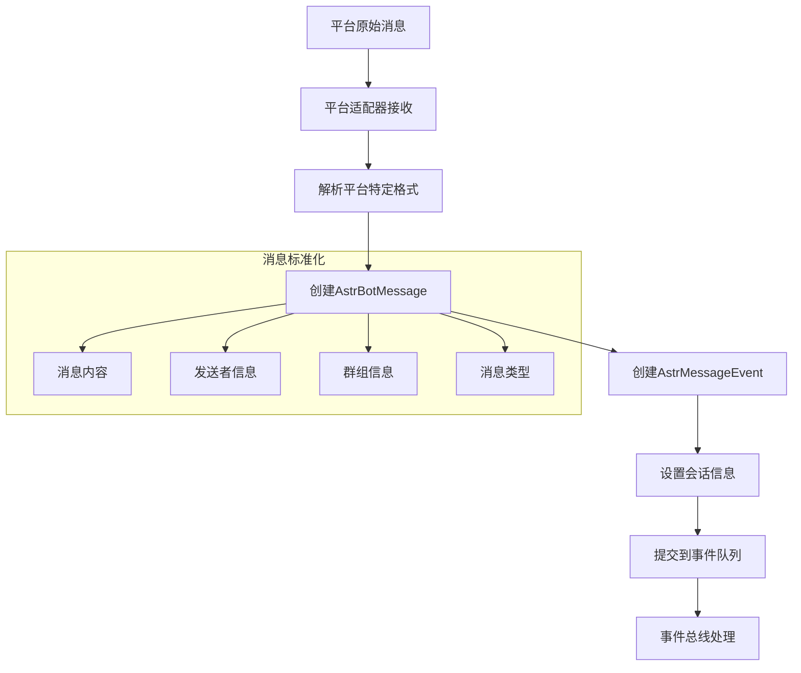
```mermaid
flowchart TD
    A["平台原始消息"] --> B["平台适配器接收"]
    B --> C["解析平台特定格式"]
    C --> D["创建AstrBotMessage"]
    D --> E["创建AstrMessageEvent"]
    E --> F["设置会话信息"]
    F --> G["提交到事件队列"]
    G --> H["事件总线处理"]
    
    subgraph "消息标准化"
        D1["消息内容"]
        D2["发送者信息"]
        D3["群组信息"]
        D4["消息类型"]
        D --> D1
        D --> D2
        D --> D3
        D --> D4
    end
```

### 3.6 提供商管理器 (ProviderManager)

提供商管理器负责管理各种AI服务提供商，包括LLM、TTS、STT等服务。

#### 3.6.1 提供商类型架构

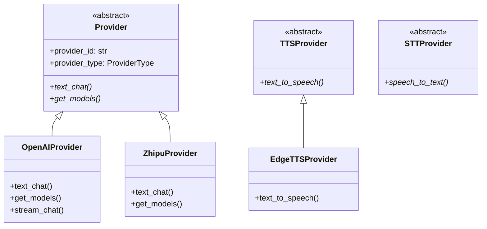
```mermaid
classDiagram
    class Provider {
        <<abstract>>
        +provider_id: str
        +provider_type: ProviderType
        +text_chat()* 
        +get_models()*
    }
    
    class TTSProvider {
        <<abstract>>
        +text_to_speech()*
    }
    
    class STTProvider {
        <<abstract>>
        +speech_to_text()*
    }
    
    class OpenAIProvider {
        +text_chat()
        +get_models()
        +stream_chat()
    }
    
    class ZhipuProvider {
        +text_chat()
        +get_models()
    }
    
    class EdgeTTSProvider {
        +text_to_speech()
    }
    
    Provider <|-- OpenAIProvider
    Provider <|-- ZhipuProvider
    TTSProvider <|-- EdgeTTSProvider
```

#### 3.6.2 AI服务调用流程

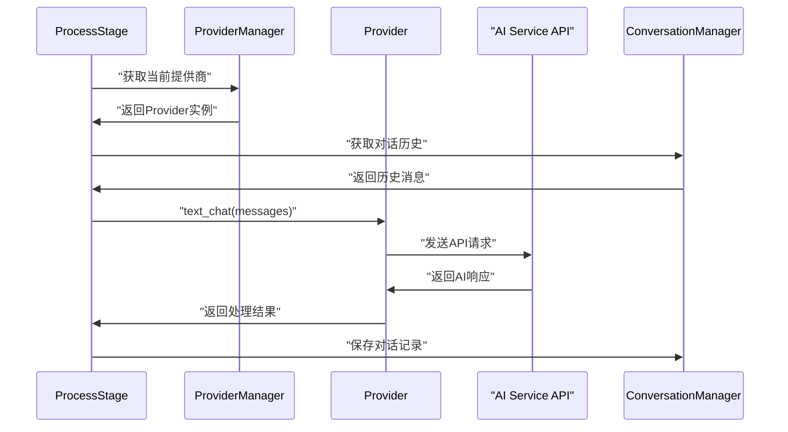
```mermaid
sequenceDiagram
    participant PS as ProcessStage
    participant PM as ProviderManager
    participant P as Provider
    participant API as "AI Service API"
    participant CM as ConversationManager
    
    PS->>PM: "获取当前提供商"
    PM->>PS: "返回Provider实例"
    PS->>CM: "获取对话历史"
    CM->>PS: "返回历史消息"
    PS->>P: "text_chat(messages)"
    P->>API: "发送API请求"
    API->>P: "返回AI响应"
    P->>PS: "返回处理结果"
    PS->>CM: "保存对话记录"
```

## 4. 消息处理完整流程

### 4.1 端到端消息处理时序图

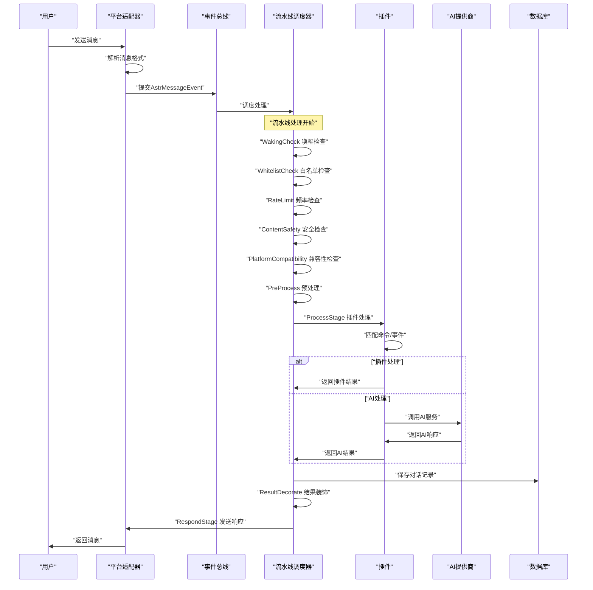
```mermaid
sequenceDiagram
    participant U as "用户"
    participant PA as "平台适配器"
    participant EB as "事件总线"
    participant PS as "流水线调度器"
    participant PLG as "插件"
    participant AI as "AI提供商"
    participant DB as "数据库"
    
    U->>PA: "发送消息"
    PA->>PA: "解析消息格式"
    PA->>EB: "提交AstrMessageEvent"
    EB->>PS: "调度处理"
    
    Note over PS: "流水线处理开始"
    PS->>PS: "WakingCheck 唤醒检查"
    PS->>PS: "WhitelistCheck 白名单检查"
    PS->>PS: "RateLimit 频率检查"
    PS->>PS: "ContentSafety 安全检查"
    PS->>PS: "PlatformCompatibility 兼容性检查"
    PS->>PS: "PreProcess 预处理"
    
    PS->>PLG: "ProcessStage 插件处理"
    PLG->>PLG: "匹配命令/事件"
    alt "插件处理"
        PLG->>PS: "返回插件结果"
    else "AI处理"
        PLG->>AI: "调用AI服务"
        AI->>PLG: "返回AI响应"
        PLG->>PS: "返回AI结果"
    end
    
    PS->>DB: "保存对话记录"
    PS->>PS: "ResultDecorate 结果装饰"
    PS->>PA: "RespondStage 发送响应"
    PA->>U: "返回消息"
```

### 4.2 消息处理状态机

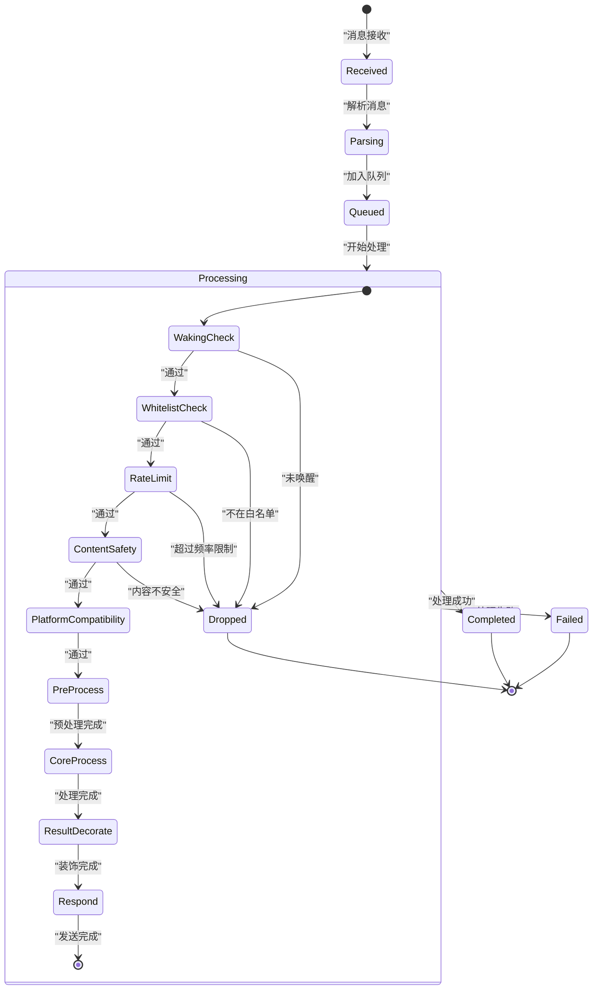
```mermaid
stateDiagram-v2
    [*] --> Received: "消息接收"
    Received --> Parsing: "解析消息"
    Parsing --> Queued: "加入队列"
    Queued --> Processing: "开始处理"
    
    state Processing {
        [*] --> WakingCheck
        WakingCheck --> WhitelistCheck: "通过"
        WakingCheck --> Dropped: "未唤醒"
        WhitelistCheck --> RateLimit: "通过"
        WhitelistCheck --> Dropped: "不在白名单"
        RateLimit --> ContentSafety: "通过"
        RateLimit --> Dropped: "超过频率限制"
        ContentSafety --> PlatformCompatibility: "通过"
        ContentSafety --> Dropped: "内容不安全"
        PlatformCompatibility --> PreProcess: "通过"
        PreProcess --> CoreProcess: "预处理完成"
        CoreProcess --> ResultDecorate: "处理完成"
        ResultDecorate --> Respond: "装饰完成"
        Respond --> [*]: "发送完成"
    }
    
    Processing --> Completed: "处理成功"
    Processing --> Failed: "处理失败"
    Dropped --> [*]
    Completed --> [*]
    Failed --> [*]
```

## 5. 数据模型设计

### 5.1 核心数据结构

#### 5.1.1 消息事件模型

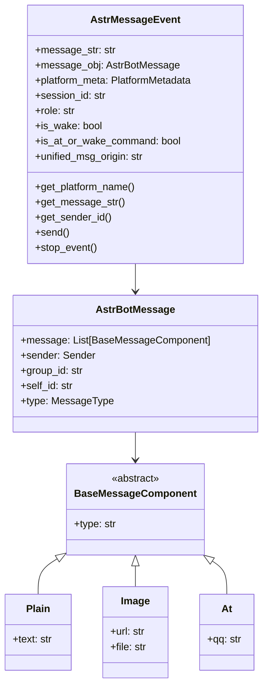
```mermaid
classDiagram
    class AstrMessageEvent {
        +message_str: str
        +message_obj: AstrBotMessage
        +platform_meta: PlatformMetadata
        +session_id: str
        +role: str
        +is_wake: bool
        +is_at_or_wake_command: bool
        +unified_msg_origin: str
        +get_platform_name()
        +get_message_str()
        +get_sender_id()
        +send()
        +stop_event()
    }
    
    class AstrBotMessage {
        +message: List[BaseMessageComponent]
        +sender: Sender
        +group_id: str
        +self_id: str
        +type: MessageType
    }
    
    class BaseMessageComponent {
        <<abstract>>
        +type: str
    }
    
    class Plain {
        +text: str
    }
    
    class Image {
        +url: str
        +file: str
    }
    
    class At {
        +qq: str
    }
    
    AstrMessageEvent --> AstrBotMessage
    AstrBotMessage --> BaseMessageComponent
    BaseMessageComponent <|-- Plain
    BaseMessageComponent <|-- Image
    BaseMessageComponent <|-- At
```

#### 5.1.2 会话管理模型

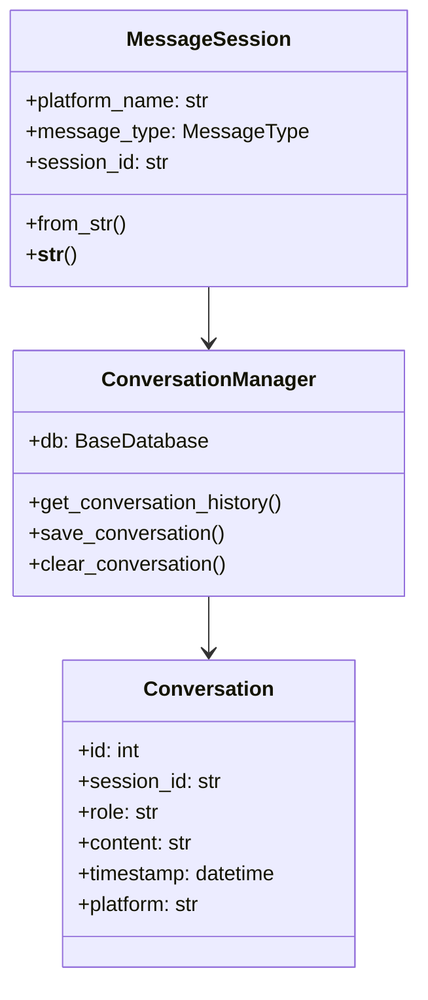
```mermaid
classDiagram
    class MessageSession {
        +platform_name: str
        +message_type: MessageType
        +session_id: str
        +from_str()
        +__str__()
    }
    
    class Conversation {
        +id: int
        +session_id: str
        +role: str
        +content: str
        +timestamp: datetime
        +platform: str
    }
    
    class ConversationManager {
        +db: BaseDatabase
        +get_conversation_history()
        +save_conversation()
        +clear_conversation()
    }
    
    ConversationManager --> Conversation
    MessageSession --> ConversationManager
```

### 5.2 配置管理模型

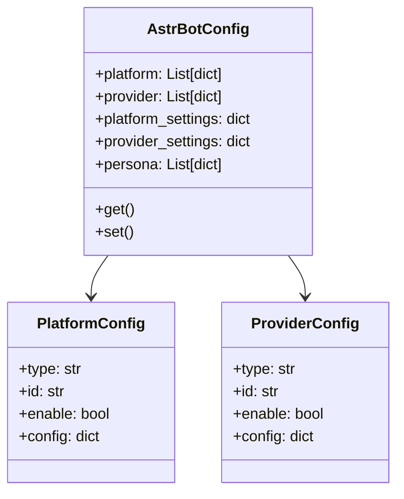
```mermaid
classDiagram
    class AstrBotConfig {
        +platform: List[dict]
        +provider: List[dict]
        +platform_settings: dict
        +provider_settings: dict
        +persona: List[dict]
        +get()
        +set()
    }
    
    class PlatformConfig {
        +type: str
        +id: str
        +enable: bool
        +config: dict
    }
    
    class ProviderConfig {
        +type: str
        +id: str
        +enable: bool
        +config: dict
    }
    
    AstrBotConfig --> PlatformConfig
    AstrBotConfig --> ProviderConfig
```

## 6. 扩展性设计

### 6.1 插件扩展机制

#### 6.1.1 插件开发模式

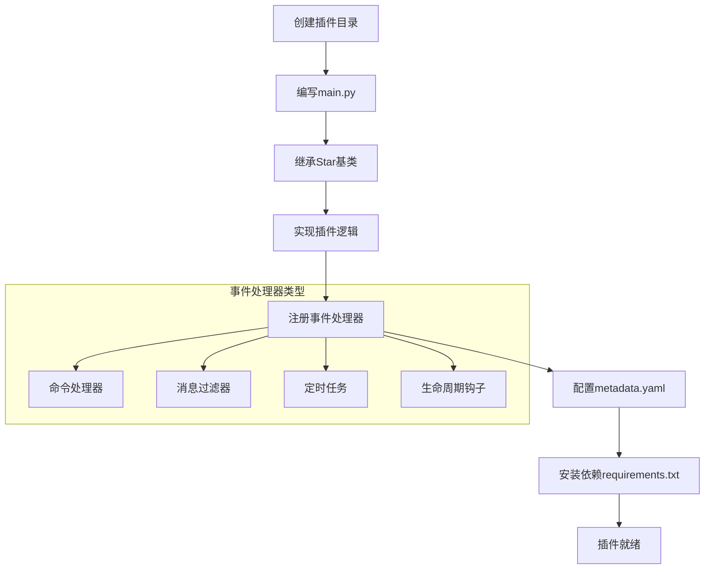
```mermaid
flowchart TD
    A["创建插件目录"] --> B["编写main.py"]
    B --> C["继承Star基类"]
    C --> D["实现插件逻辑"]
    D --> E["注册事件处理器"]
    E --> F["配置metadata.yaml"]
    F --> G["安装依赖requirements.txt"]
    G --> H["插件就绪"]
    
    subgraph "事件处理器类型"
        E1["命令处理器"]
        E2["消息过滤器"]
        E3["定时任务"]
        E4["生命周期钩子"]
        E --> E1
        E --> E2
        E --> E3
        E --> E4
    end
```

#### 6.1.2 插件通信机制

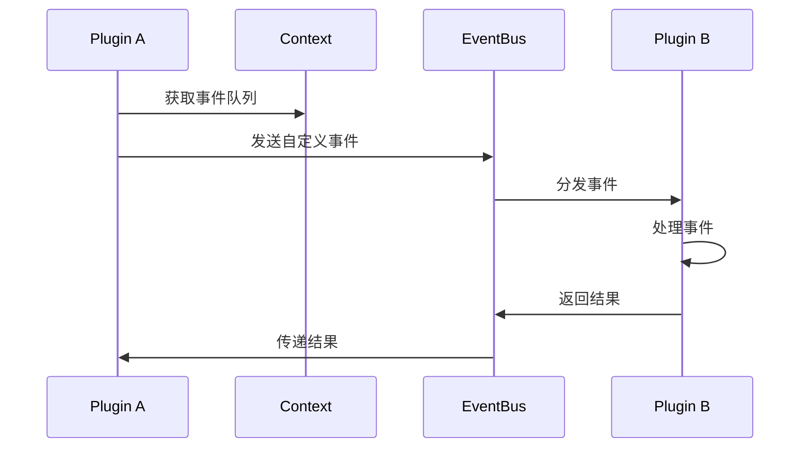
```mermaid
sequenceDiagram
    participant P1 as Plugin A
    participant C as Context
    participant EB as EventBus
    participant P2 as Plugin B
    
    P1->>C: 获取事件队列
    P1->>EB: 发送自定义事件
    EB->>P2: 分发事件
    P2->>P2: 处理事件
    P2->>EB: 返回结果
    EB->>P1: 传递结果
```

### 6.2 平台扩展机制

#### 6.2.1 新平台适配器开发

```mermaid
flowchart TD
    A["创建适配器类"] --> B["继承Platform基类"]
    B --> C["实现run方法"]
    C --> D["实现meta方法"]
    D --> E["处理平台消息"]
    E --> F["转换为AstrMessageEvent"]
    F --> G["提交到事件队列"]
    G --> H["注册到平台管理器"]
    
    subgraph "必须实现的方法"
        C1["run() - 启动平台连接"]
        C2["meta() - 返回平台元数据"]
        C3["send_by_session() - 发送消息"]
        C --> C1
        D --> C2
        G --> C3
    end
```

### 6.3 AI提供商扩展机制

#### 6.3.1 新提供商开发流程

```mermaid
flowchart TD
    A["创建提供商类"] --> B["继承Provider基类"]
    B --> C["实现text_chat方法"]
    C --> D["实现get_models方法"]
    D --> E["处理API调用"]
    E --> F["错误处理和重试"]
    F --> G["注册到提供商管理器"]
    
    subgraph "可选功能"
        O1["流式响应"]
        O2["函数调用"]
        O3["多模态支持"]
        O4["嵌入向量"]
        G --> O1
        G --> O2
        G --> O3
        G --> O4
    end
```

## 7. 性能优化设计

### 7.1 异步处理架构

```mermaid
graph TD
    A["消息接收"] --> B["异步队列"]
    B --> C["事件总线"]
    C --> D["并发处理"]
    
    subgraph "并发处理池"
        D1["任务1"]
        D2["任务2"]
        D3["任务3"]
        D4["任务N"]
        D --> D1
        D --> D2
        D --> D3
        D --> D4
    end
    
    D1 --> E["响应发送"]
    D2 --> E
    D3 --> E
    D4 --> E
```

### 7.2 资源管理策略

- **连接池管理**：AI服务和数据库连接复用
- **内存优化**：大文件流式处理，避免内存溢出
- **缓存机制**：频繁访问的配置和数据缓存
- **任务隔离**：异常任务不影响其他任务执行

## 8. 安全性设计

### 8.1 安全检查流程

```mermaid
flowchart TD
    A["消息输入"] --> B["内容安全检查"]
    B --> C["权限验证"]
    C --> D["频率限制"]
    D --> E["白名单验证"]
    E --> F["敏感信息过滤"]
    F --> G["安全处理"]
    
    B -->|"不安全"| H["拒绝处理"]
    C -->|"无权限"| H
    D -->|"超频"| H
    E -->|"不在白名单"| H
```

### 8.2 数据保护机制

- **配置加密**：敏感配置信息加密存储
- **日志脱敏**：自动过滤日志中的敏感信息
- **访问控制**：基于角色的权限管理
- **数据隔离**：不同会话数据完全隔离

## 9. 监控和运维

### 9.1 日志系统架构

```mermaid
flowchart TD
    A["应用日志"] --> B["LogBroker"]
    B --> C["日志队列"]
    C --> D["日志处理器"]
    D --> E["文件输出"]
    D --> F["控制台输出"]
    D --> G["Web面板显示"]
    
    subgraph "日志级别"
        L1["DEBUG"]
        L2["INFO"]
        L3["WARNING"]
        L4["ERROR"]
        L5["CRITICAL"]
    end
```

### 9.2 性能监控指标

- **消息处理延迟**：从接收到响应的时间
- **并发处理能力**：同时处理的消息数量
- **错误率统计**：各组件的错误发生率
- **资源使用情况**：CPU、内存、网络使用率

## 10. 部署架构

### 10.1 单机部署架构

```mermaid
graph TD
    subgraph "AstrBot 进程"
        A["main.py"]
        B["Core Lifecycle"]
        C["Event Bus"]
        D["Platform Adapters"]
        E["AI Providers"]
        F["Plugins"]
    end
    
    subgraph "Web 管理面板"
        G["Dashboard Server"]
        H["静态资源"]
    end
    
    subgraph "数据存储"
        I["SQLite 数据库"]
        J["配置文件"]
        K["插件文件"]
        L["临时文件"]
    end
    
    A --> B
    B --> C
    B --> D
    B --> E
    B --> F
    B --> G
    B --> I
    B --> J
    G --> H
    F --> K
    E --> L
```

### 10.2 容器化部署

```mermaid
graph TD
    subgraph "Docker 容器"
        A["AstrBot 应用"]
        B["Python 运行时"]
        C["依赖库"]
    end
    
    subgraph "数据卷"
        D["配置数据"]
        E["插件数据"]
        F["数据库文件"]
        G["日志文件"]
    end
    
    subgraph "网络"
        H["Web 端口 6185"]
        I["平台连接"]
    end
    
    A --> D
    A --> E
    A --> F
    A --> G
    A --> H
    A --> I
```

## 11. 总结

AstrBot 采用了现代化的异步事件驱动架构，具有以下核心优势：

### 11.1 架构优势

1. **高度模块化**：各组件职责清晰，耦合度低
2. **异步高性能**：全异步处理，支持高并发
3. **扩展性强**：插件系统和适配器模式支持灵活扩展
4. **事件驱动**：基于事件总线的松耦合架构
5. **流水线处理**：洋葱模型确保处理流程的可控性

### 11.2 技术特色

1. **统一消息模型**：抽象化不同平台的消息格式
2. **智能路由**：基于规则和AI的消息处理路由
3. **热重载支持**：插件和配置的热更新能力
4. **多AI集成**：统一的AI服务提供商接口
5. **Web管理界面**：可视化的配置和监控面板

### 11.3 发展方向

1. **微服务化**：支持分布式部署
2. **集群支持**：多实例负载均衡
3. **更多平台**：扩展更多聊天平台支持
4. **AI能力增强**：集成更多AI服务和能力
5. **企业级功能**：权限管理、审计日志等企业功能

AstrBot 的架构设计充分体现了现代软件工程的最佳实践，为构建可扩展、高性能的聊天机器人系统提供了优秀的技术基础。