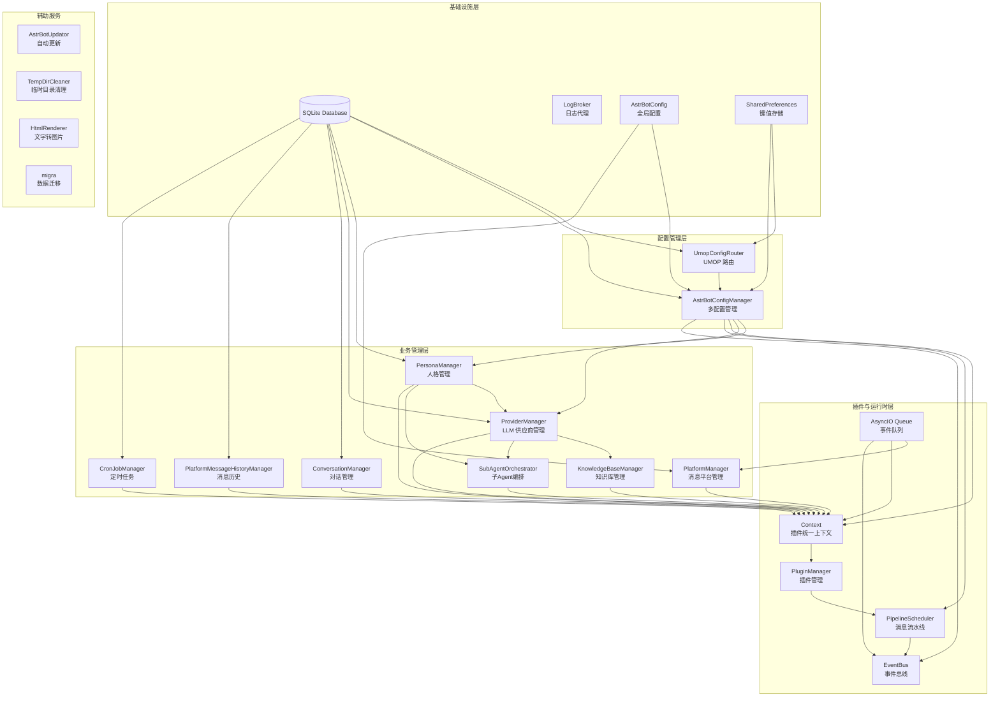
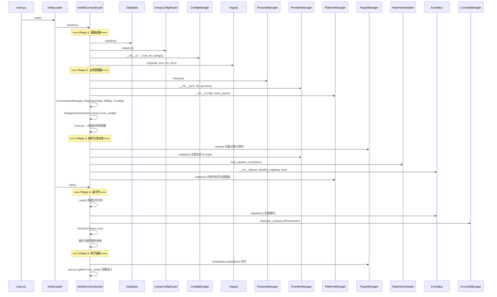
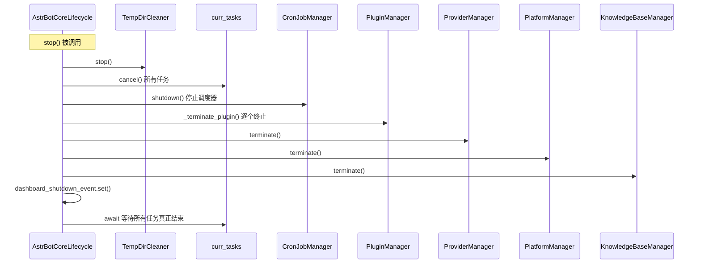
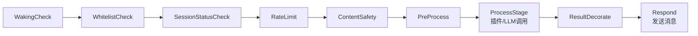
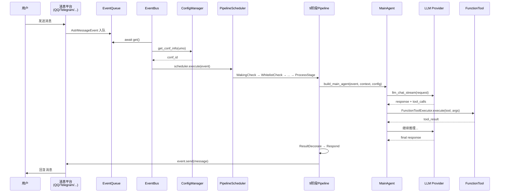
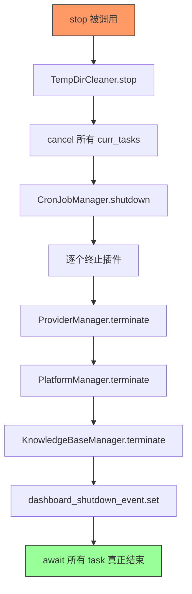

# AstrBotCoreLifecycle 核心生命周期组件分析

> 源文件：`astrbot/core/core_lifecycle.py`

---

## 一、整体架构

`AstrBotCoreLifecycle` 是 AstrBot 系统的**核心编排器**，负责所有组件的初始化顺序、运行时任务管理和优雅关停。

### 组件依赖全景图



---

## 二、生命周期时序图

### 2.1 启动时序



### 2.2 关停时序



---

## 三、各组件详细分析

### 3.1 Database（SQLite 数据库）

| 属性 | 值 |
|------|-----|
| 源文件 | `astrbot/core/db/sqlite.py` |
| 类名 | `SQLiteDatabase` |
| 初始化阶段 | Phase 1（最先） |

**职责**：所有持久化数据的存储层，包括对话历史、CronJob、Persona、插件配置、平台消息等。

**依赖关系**：被几乎所有管理器依赖（ConversationManager、CronJobManager、PersonaManager 等）。

---

### 3.2 UmopConfigRouter（UMOP 配置路由器）

| 属性 | 值 |
|------|-----|
| 源文件 | `astrbot/core/umop_config_router.py` |
| 类名 | `UmopConfigRouter` |
| 初始化阶段 | Phase 1 |

**职责**：将统一消息来源（`platform:type:session_id`）映射到对应的配置文件 ID。支持通配符匹配。

**核心逻辑**：
- `get_conf_id_for_umop(umo)` — 根据 UMO 字符串查找对应配置
- 支持 `fnmatch` 通配符，实现灵活的路由规则（如 `qq:*:*` 匹配所有 QQ 会话）

**被谁使用**：`AstrBotConfigManager` 通过它实现"不同会话使用不同配置"。

---

### 3.3 AstrBotConfigManager（多配置管理器）

| 属性 | 值 |
|------|-----|
| 源文件 | `astrbot/core/astrbot_config_mgr.py` |
| 类名 | `AstrBotConfigManager` |
| 初始化阶段 | Phase 1 |

**职责**：管理多套配置文件（`default` + 自定义配置），根据 UMOP 路由返回对应会话的配置。

**核心数据结构**：
```python
self.confs: dict[str, AstrBotConfig]  # "default" / uuid -> 配置实例
```

**关键方法**：
- `get_conf_info(umo)` — 返回 `ConfInfo{id, name, path}`
- `_load_all_configs()` — 启动时加载所有配置文件

**被谁使用**：EventBus（分发事件到正确的 Pipeline）、PipelineScheduler（每个配置一个调度器）。

---

### 3.4 PersonaManager（人格管理器）

| 属性 | 值 |
|------|-----|
| 源文件 | `astrbot/core/persona_mgr.py` |
| 类名 | `PersonaManager` |
| 初始化阶段 | Phase 2 |

**职责**：管理 AI 角色/人格设定，包括系统提示词、开场白对话、工具/技能绑定。

**核心功能**：
- 从数据库加载所有 Persona
- 支持 V3 格式人格（`Personality` 数据类）
- 提供 `get_persona_v3_by_id()` 供 Agent 构建时注入人格

**被谁依赖**：`ProviderManager`、`SubAgentOrchestrator`、`build_main_agent()`。

---

### 3.5 ProviderManager（LLM 供应商管理器）

| 属性 | 值 |
|------|-----|
| 源文件 | `astrbot/core/provider/manager.py` |
| 类名 | `ProviderManager` |
| 初始化阶段 | Phase 2（构造） → Phase 3（initialize） |

**职责**：管理所有 LLM 供应商实例（Chat/STT/TTS/Embedding/Rerank 五类），提供统一的模型调用接口。

**管理的实例类型**：
```python
provider_insts: list[Provider]            # Chat LLM
stt_provider_insts: list[STTProvider]     # 语音转文本
tts_provider_insts: list[TTSProvider]     # 文本转语音
embedding_provider_insts: list[EmbeddingProvider]  # 向量化
rerank_provider_insts: list[RerankProvider]        # 重排序
```

**注意**：构造和初始化分两步——先构造（Phase 2），等 PluginManager 加载完后再 `initialize()`（Phase 3），因为插件可能注册自定义 Provider。

---

### 3.6 PlatformManager（消息平台管理器）

| 属性 | 值 |
|------|-----|
| 源文件 | `astrbot/core/platform/manager.py` |
| 类名 | `PlatformManager` |
| 初始化阶段 | Phase 2（构造） → Phase 3 末尾（initialize） |

**职责**：管理所有消息平台适配器（QQ/Telegram/企微/飞书等），每个平台实例作为独立 asyncio Task 运行。

**核心机制**：
- 平台产生消息 → 包装为 `AstrMessageEvent` → 放入 `event_queue`
- 支持运行时动态添加/移除平台

---

### 3.7 ConversationManager（对话管理器）

| 属性 | 值 |
|------|-----|
| 源文件 | `astrbot/core/conversation_mgr.py` |
| 类名 | `ConversationManager` |
| 初始化阶段 | Phase 2 |

**职责**：管理会话与对话的映射关系，支持多对话切换、历史记录持久化。

**核心概念**：
- **会话 (Session)**：由 `unified_msg_origin` 标识的对话窗口
- **对话 (Conversation)**：一个会话下可以有多个对话，支持切换

---

### 3.8 KnowledgeBaseManager（知识库管理器）

| 属性 | 值 |
|------|-----|
| 源文件 | `astrbot/core/knowledge_base/kb_mgr.py` |
| 类名 | `KnowledgeBaseManager` |
| 初始化阶段 | Phase 2（构造） → Phase 3（initialize） |

**职责**：管理知识库的文档解析、向量化、检索（RAG）能力。

**依赖**：需要 `ProviderManager` 提供 Embedding 模型。

---

### 3.9 CronJobManager（定时任务管理器）

| 属性 | 值 |
|------|-----|
| 源文件 | `astrbot/core/cron/manager.py` |
| 类名 | `CronJobManager` |
| 初始化阶段 | Phase 2（构造） → Phase 4（start） |

**职责**：基于 APScheduler 的定时任务系统，支持周期性任务和一次性任务，能主动唤醒 Agent 执行。

**运行时行为**：在 `_load()` 阶段作为独立 asyncio Task 启动，从数据库同步已有任务。

---

### 3.10 SubAgentOrchestrator（子 Agent 编排器）

| 属性 | 值 |
|------|-----|
| 源文件 | `astrbot/core/subagent_orchestrator.py` |
| 类名 | `SubAgentOrchestrator` |
| 初始化阶段 | Phase 2 |

**职责**：从配置加载子 Agent 定义，为每个子 Agent 创建 `HandoffTool`，注册到主 Agent 的工具集中。

**核心机制**：
```
配置 → Agent[name, instructions, tools] → HandoffTool → 注册到 ToolSet
```

---

### 3.11 Context（插件统一上下文）

| 属性 | 值 |
|------|-----|
| 源文件 | `astrbot/core/star/context.py` |
| 类名 | `Context` |
| 初始化阶段 | Phase 2 末尾 |

**职责**：将所有管理器的引用聚合为一个对象，作为**插件与核心系统的唯一桥梁**。

**包含的引用**：
```python
Context(
    event_queue,           # 事件队列
    config,                # 全局配置
    db,                    # 数据库
    provider_manager,      # LLM 供应商
    platform_manager,      # 消息平台
    conversation_manager,  # 对话管理
    message_history_manager, # 消息历史
    persona_manager,       # 人格管理
    astrbot_config_mgr,    # 配置管理
    kb_manager,            # 知识库
    cron_manager,          # 定时任务
    subagent_orchestrator, # 子Agent编排
)
```

---

### 3.12 PluginManager（插件管理器）

| 属性 | 值 |
|------|-----|
| 源文件 | `astrbot/core/star/star_manager.py` |
| 类名 | `PluginManager` |
| 初始化阶段 | Phase 3 |

**职责**：扫描、加载、注册、实例化所有插件（Star），管理插件生命周期。

**`reload()` 流程**：扫描插件目录 → 解析元数据 → 注册 Handler 到 `StarHandlerRegistry` → 实例化插件类。

---

### 3.13 PipelineScheduler（消息流水线调度器）

| 属性 | 值 |
|------|-----|
| 源文件 | `astrbot/core/pipeline/scheduler.py` |
| 类名 | `PipelineScheduler` |
| 初始化阶段 | Phase 3 |

**职责**：驱动 9 阶段洋葱模型的消息处理流水线。



**每个配置对应一个独立的 PipelineScheduler 实例**，存储在 `pipeline_scheduler_mapping: dict[str, PipelineScheduler]` 中。

---

### 3.14 EventBus（事件总线）

| 属性 | 值 |
|------|-----|
| 源文件 | `astrbot/core/event_bus.py` |
| 类名 | `EventBus` |
| 初始化阶段 | Phase 3 末尾 |

**职责**：从事件队列中取出消息事件，路由到正确的 PipelineScheduler 执行。

**核心循环**：
```python
async def dispatch(self):
    while True:
        event = await self.event_queue.get()
        conf_id = self.astrbot_config_mgr.get_conf_info(event.unified_msg_origin)["id"]
        scheduler = self.pipeline_scheduler_mapping[conf_id]
        asyncio.create_task(scheduler.execute(event))
```

---

### 3.15 辅助组件

| 组件 | 源文件 | 职责 |
|------|--------|------|
| `AstrBotUpdator` | `astrbot/core/updator.py` | 检查/下载/应用版本更新，支持热重启 |
| `TempDirCleaner` | `astrbot/core/utils/temp_dir_cleaner.py` | 定期清理临时目录，防止磁盘占满 |
| `PlatformMessageHistoryManager` | `astrbot/core/platform_message_history_mgr.py` | 记录平台原始消息历史 |
| `HtmlRenderer` | `astrbot/core/utils/t2i/renderer.py` | 文字转图片渲染（长文本场景） |
| `migra()` | `astrbot/core/utils/migra_helper.py` | 版本升级的数据库/配置迁移 |

---

## 四、运行时消息处理流程



---

## 五、初始化顺序与依赖链

```mermaid
graph TB
    subgraph "Phase 1: 基础设施"
        direction LR
        P1A[DB.initialize] --> P1B[HtmlRenderer]
        P1B --> P1C[UmopConfigRouter]
        P1C --> P1D[AstrBotConfigManager]
        P1D --> P1E[TempDirCleaner]
        P1E --> P1F[migra 数据迁移]
    end

    subgraph "Phase 2: 业务管理器"
        direction LR
        P2A[EventQueue] --> P2B[PersonaManager]
        P2B --> P2C[ProviderManager 构造]
        P2C --> P2D[PlatformManager 构造]
        P2D --> P2E[ConversationManager]
        P2E --> P2F[KBManager 构造]
        P2F --> P2G[CronJobManager]
        P2G --> P2H[SubAgentOrchestrator]
        P2H --> P2I["Context(聚合所有管理器)"]
    end

    subgraph "Phase 3: 插件与流水线"
        direction LR
        P3A[PluginManager.reload] --> P3B[ProviderManager.initialize]
        P3B --> P3C[KBManager.initialize]
        P3C --> P3D[PipelineScheduler 加载]
        P3D --> P3E[EventBus 创建]
        P3E --> P3F[PlatformManager.initialize]
    end

    subgraph "Phase 4: 运行时任务"
        direction LR
        P4A[EventBus.dispatch 循环] --> P4B[CronManager.start]
        P4B --> P4C[TempDirCleaner.run]
        P4C --> P4D[插件额外协程]
    end

    subgraph "Phase 5: 就绪通知"
        P5A[OnAstrBotLoadedEvent 钩子]
        P5B["asyncio.gather(*tasks) 阻塞"]
    end

    P1F --> P2A
    P2I --> P3A
    P3F --> P4A
    P4D --> P5A
    P5A --> P5B

    style P1F fill:#ff9,stroke:#333
    style P2I fill:#9cf,stroke:#333
    style P4A fill:#9f9,stroke:#333
```



---

## 六、关停流程



**关停顺序设计原则**：
1. 先停辅助服务（TempCleaner）
2. 取消异步任务（停止接收新事件）
3. 停止定时调度（不再触发新任务）
4. 终止插件（释放插件持有的资源）
5. 终止 Provider/Platform/KB（关闭外部连接）
6. 通知 Dashboard 退出
7. 等待所有任务完成（确保无悬挂协程）
