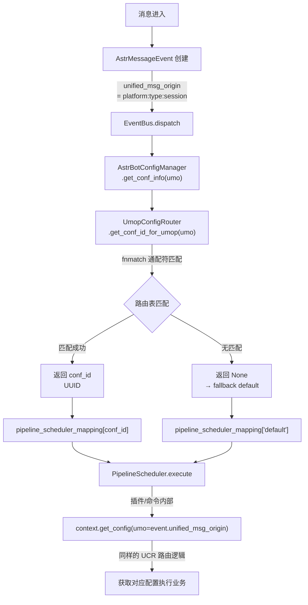
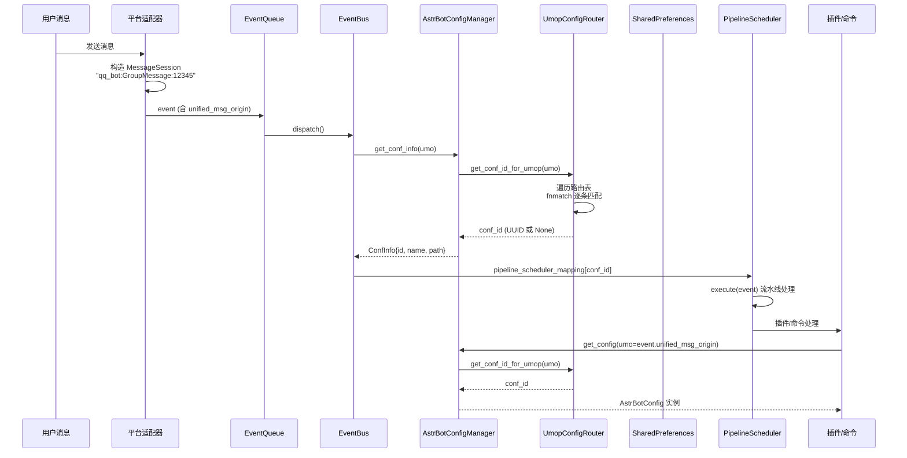
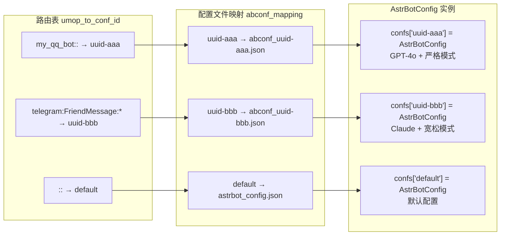
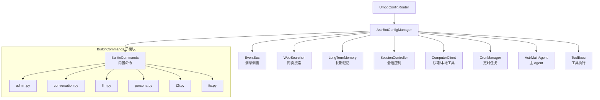
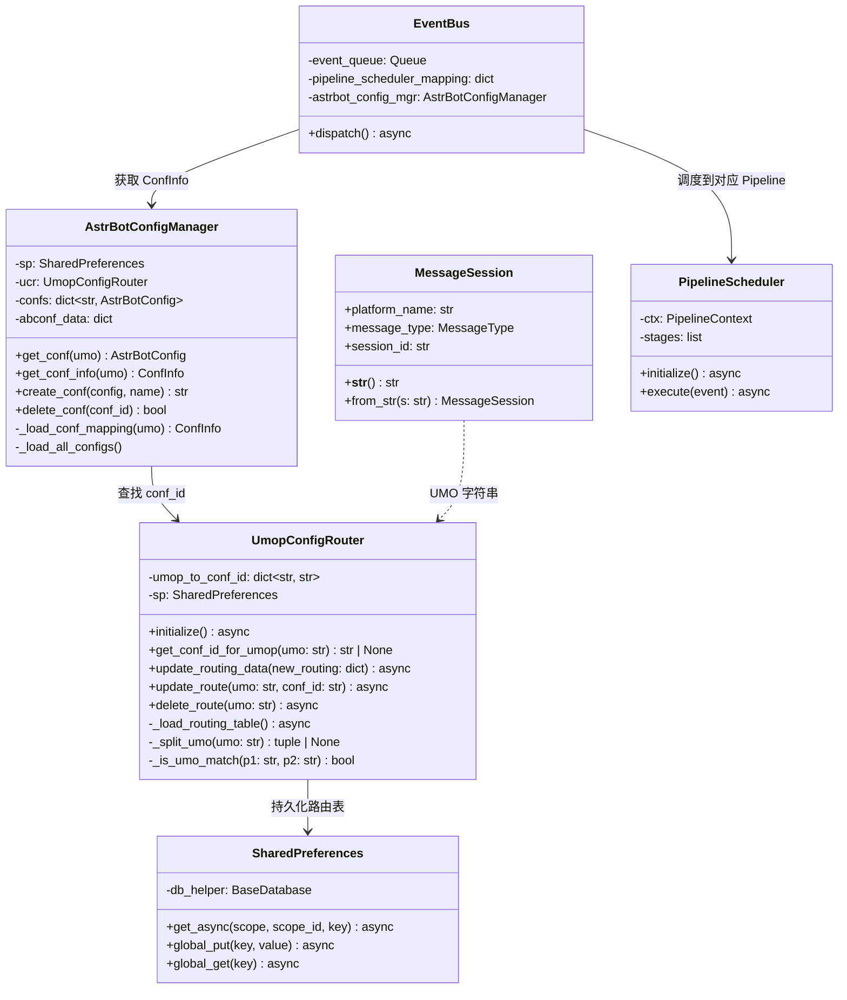

# UMOP 配置路由系统深度分析

> 文件：`astrbot/core/umop_config_router.py`
> 相关文件：`astrbot_config_mgr.py`, `event_bus.py`, `message_session.py`, `shared_preferences.py`, `pipeline/scheduler.py`

---

## 1. 概述

UMOP（Unified Message Origin Platform）配置路由是 AstrBot **多配置隔离**的核心机制。它解决了一个关键问题：

> **同一个 AstrBot 实例如何对不同的消息来源使用不同的配置？**

例如：QQ 群聊使用严格模式 + GPT-4o，Telegram 私聊使用宽松模式 + Claude，Discord 频道使用自定义人格 — 这些都通过 UMOP 路由实现。

---

## 2. 核心概念

### 2.1 UMO（Unified Message Origin）

UMO 是消息来源的唯一标识字符串，格式为：

```
[platform_id]:[message_type]:[session_id]
```

| 段 | 含义 | 示例 |
|---|------|------|
| `platform_id` | 平台适配器实例 ID | `my_qq_bot`, `telegram_01`, `discord_main` |
| `message_type` | 消息类型枚举 | `GroupMessage`, `FriendMessage`, `OtherMessage` |
| `session_id` | 会话标识（群号/用户ID等） | `123456789`, `user_abc` |

**完整 UMO 示例：**
- `my_qq_bot:GroupMessage:123456789` — QQ 群聊
- `telegram_01:FriendMessage:user_abc` — Telegram 私聊
- `discord_main:GroupMessage:channel_xyz` — Discord 频道

### 2.2 构造来源

UMO 由 `MessageSession` 类构造：

```python
# astrbot/core/platform/message_session.py
@dataclass
class MessageSession:
    platform_name: str
    message_type: MessageType
    session_id: str
    
    def __str__(self) -> str:
        return f"{self.platform_id}:{self.message_type.value}:{self.session_id}"
```

在 `AstrMessageEvent.__init__()` 中自动创建：

```python
self.session = MessageSession(
    platform_name=platform_meta.id,
    message_type=message_type,
    session_id=session_id,
)
```

通过 property 暴露：

```python
@property
def unified_msg_origin(self) -> str:
    return str(self.session)
```

---

## 3. 技术架构

### 3.1 整体数据流



### 3.2 组件协作时序图



---

## 4. 核心技术原理

### 4.1 路由匹配算法

`UmopConfigRouter` 的核心是 **三段式通配符匹配**，基于 Python 标准库 `fnmatch`：

```python
def _is_umo_match(self, p1: str, p2: str) -> bool:
    """判断 p2 umo 是否逻辑包含于 p1 umo"""
    p1_ls = self._split_umo(p1)  # pattern（路由表中的规则）
    p2_ls = self._split_umo(p2)  # target（实际消息的 UMO）
    
    return all(
        p == "" or fnmatch.fnmatchcase(t, p)
        for p, t in zip(p1_ls, p2_ls)
    )
```

**匹配逻辑**：将 pattern 和 target 各拆为 3 段，逐段匹配：
- **空字符串 `""`** → 匹配任意值（通配所有）
- **非空** → 使用 `fnmatch.fnmatchcase()` 进行 **区分大小写的 glob 匹配**

#### fnmatch 支持的通配符

| 模式 | 含义 | 示例 |
|------|------|------|
| `*` | 匹配任意字符串 | `*` 匹配所有 |
| `?` | 匹配单个字符 | `user_?` 匹配 `user_a` |
| `[seq]` | 匹配 seq 中的字符 | `[abc]` 匹配 `a`, `b`, `c` |
| `[!seq]` | 匹配不在 seq 中的字符 | `[!abc]` 匹配非 a/b/c |

#### 路由规则示例

| 路由 Pattern | 含义 | 匹配 | 不匹配 |
|-------------|------|------|--------|
| `::` | 所有消息来源 | 全部 | — |
| `my_qq::` | my_qq 平台的所有消息 | `my_qq:GroupMessage:123` | `telegram:FriendMessage:456` |
| `my_qq:GroupMessage:` | my_qq 所有群消息 | `my_qq:GroupMessage:123` | `my_qq:FriendMessage:789` |
| `my_qq:GroupMessage:12345` | my_qq 精确到某个群 | `my_qq:GroupMessage:12345` | `my_qq:GroupMessage:67890` |
| `*:FriendMessage:*` | 所有平台的私聊 | `telegram:FriendMessage:u1` | `discord:GroupMessage:ch1` |
| `qq_*::` | ID 以 qq_ 开头的平台 | `qq_bot1:GroupMessage:1` | `telegram:FriendMessage:2` |

### 4.2 查找优先级

```python
def get_conf_id_for_umop(self, umo: str) -> str | None:
    for pattern, conf_id in self.umop_to_conf_id.items():
        if self._is_umo_match(pattern, umo):
            return conf_id  # ← 首次匹配即返回
    return None
```

**关键特性：先到先得（First Match Wins）**。路由表是 `dict`，遍历顺序即 Python 3.7+ 的插入顺序。第一个匹配的 pattern 获胜。

> ⚠️ **注意**：如果同时存在 `"::"`（全匹配）和 `"my_qq::"`（精确匹配），且 `"::"` 先被插入，则 `"::"` 会先匹配，精确规则永远不会生效。**管理路由时需注意插入顺序**。

### 4.3 数据持久化

路由表 **不使用独立数据库表**，而是通过 `SharedPreferences` 存储在 SQLite 的 `preference` 表中：

```
┌─────────────────────────────────────────────┐
│ preference 表                                │
├───────┬───────────┬──────────────────────────┤
│ scope │ scope_id  │ key                       │
│ global│ global    │ umop_config_routing        │
├───────┴───────────┴──────────────────────────┤
│ value (JSON):                                 │
│ {                                             │
│   "val": {                                    │
│     "my_qq_bot::": "uuid-aaa-bbb",           │
│     "telegram:FriendMessage:*": "uuid-ccc",   │
│     "::": "default"                           │
│   }                                           │
│ }                                             │
└───────────────────────────────────────────────┘
```

**读取链路**：
```
SharedPreferences.get_async("global", "global", "umop_config_routing")
  → db_helper.get_preference("global", "global", "umop_config_routing")
    → SQL: SELECT * FROM preference WHERE scope='global' AND scope_id='global' AND key='umop_config_routing'
      → result.value["val"] → dict
```

**写入链路**：
```
SharedPreferences.global_put("umop_config_routing", routing_dict)
  → db_helper.insert_preference_or_update("global", "global", "umop_config_routing", {"val": routing_dict})
    → SQL: INSERT OR REPLACE INTO preference ...
```

### 4.4 多配置文件管理

`AstrBotConfigManager` 管理多个 `AstrBotConfig` 实例：

```python
class AstrBotConfigManager:
    confs: dict[str, AstrBotConfig] = {}
    #  "default"    → 默认配置文件 (data/astrbot_config.json)
    #  "uuid-xxx"   → 自定义配置文件 (data/config/abconf_uuid-xxx.json)
```

每个配置文件是独立的 JSON 文件，包含完整的 AstrBot 配置（LLM 供应商、平台设置、人格设定等）。



---

## 5. 与 Pipeline 的集成

### 5.1 PipelineScheduler 映射

在 `core_lifecycle.py` 中，**每个配置文件对应一个独立的 PipelineScheduler**：

```python
async def load_pipeline_scheduler(self) -> dict[str, PipelineScheduler]:
    mapping = {}
    for conf_id, ab_config in self.astrbot_config_mgr.confs.items():
        scheduler = PipelineScheduler(
            PipelineContext(ab_config, self.plugin_manager, conf_id),
        )
        await scheduler.initialize()
        mapping[conf_id] = scheduler
    return mapping
```

### 5.2 EventBus 调度

```python
class EventBus:
    async def dispatch(self) -> None:
        while True:
            event = await self.event_queue.get()
            # ① 通过 UMO 查找 conf_id
            conf_info = self.astrbot_config_mgr.get_conf_info(event.unified_msg_origin)
            conf_id = conf_info["id"]
            # ② 按 conf_id 查找对应的 PipelineScheduler
            scheduler = self.pipeline_scheduler_mapping.get(conf_id)
            # ③ 用对应配置的 Pipeline 处理消息
            asyncio.create_task(scheduler.execute(event))
```

这意味着：
- 不同 UMO 的消息可以进入不同的 PipelineScheduler
- 每个 PipelineScheduler 携带各自的 `AstrBotConfig`
- Pipeline 内的所有 Stage 都使用该配置

---

## 6. 全链路消费者

UMOP 路由的消费遍及整个项目，共 **15+ 个模块** 通过 `context.get_config(umo=event.unified_msg_origin)` 获取对应配置：



**统一调用模式**：
```python
cfg = self.context.get_config(umo=event.unified_msg_origin)
# cfg 是一个 AstrBotConfig 实例，包含完整配置
# 根据 UMO 不同，返回不同的配置实例
```

---

## 7. Dashboard API 管理

WebUI 通过 REST API 管理路由表：

| 端点 | 方法 | 功能 |
|------|------|------|
| `/config/umo_abconf_routes` | GET | 获取完整路由表 |
| `/config/umo_abconf_route/update_all` | POST | 全量替换路由表 |
| `/config/umo_abconf_route/update` | POST | 更新/新增一条路由 |
| `/config/umo_abconf_route/delete` | POST | 删除一条路由 |
| `/config/abconf/new` | POST | 创建新配置文件 |
| `/config/abconf/delete` | POST | 删除配置文件 |

管理流程：
```
用户在 WebUI 创建新配置 → POST /config/abconf/new → 生成 UUID + JSON 文件
用户绑定路由 → POST /config/umo_abconf_route/update → 写入路由表
消息到达时 → EventBus → UCR 匹配 → 使用对应 Pipeline
```

---

## 8. 迁移历史

v4.5 → v4.6 迁移（`migra_45_to_46.py`）：

**旧结构**：路由信息内嵌在 `abconf_mapping` 的每个配置元数据中：
```json
{
  "uuid-aaa": {
    "path": "abconf_xxx.json",
    "name": "QQ配置",
    "umop": ["my_qq_bot::"]  // ← 嵌在这里
  }
}
```

**新结构**：路由信息独立存储在 `UmopConfigRouter`（SharedPreferences）中：
```json
// abconf_mapping（不再含 umop）
{ "uuid-aaa": { "path": "abconf_xxx.json", "name": "QQ配置" } }

// umop_config_routing（独立存储）
{ "my_qq_bot::": "uuid-aaa" }
```

分离的好处：
1. 路由规则可独立增删改查，不影响配置文件元数据
2. 支持一条路由规则绑定到不同配置
3. 方便通过 Dashboard API 单独管理

---

## 9. 设计模式分析

### 9.1 策略路由模式（Strategy Router）

```
消息 → 路由器（根据 UMO 选择策略）→ 策略 A（配置 A + Pipeline A）
                                    → 策略 B（配置 B + Pipeline B）
                                    → 默认策略（default 配置）
```

### 9.2 两级间接（Double Indirection）

```
UMO string → [UCR 路由表] → conf_id (UUID) → [ACM confs 字典] → AstrBotConfig 实例
```

两级间接实现了解耦：
- 路由规则变化不影响配置文件
- 配置文件内容变化不影响路由规则
- 同一个配置文件可以被多条路由规则共享

### 9.3 Fallback 兜底

所有查找失败都 fallback 到 `"default"` 配置：
```python
# AstrBotConfigManager._load_conf_mapping()
conf_id = self.ucr.get_conf_id_for_umop(umo)
if conf_id:
    # 查找成功
    ...
return DEFAULT_CONFIG_CONF_INFO  # fallback
```

---

## 10. 类图



---

## 11. 总结

| 维度 | 设计选择 | 原因 |
|------|---------|------|
| **标识格式** | `platform:type:session` 三段式 | 覆盖平台、消息类型、会话三个维度 |
| **匹配算法** | `fnmatch` 三段独立匹配 | 轻量、支持通配符、无需正则开销 |
| **匹配策略** | First Match Wins | 简单直观，O(n) 遍历 |
| **存储方式** | SharedPreferences (SQLite KV) | 复用现有基础设施，无需额外表 |
| **配置隔离** | 每个 conf_id 独立 JSON + 独立 PipelineScheduler | 完全隔离，互不影响 |
| **Fallback** | 无匹配 → default 配置 | 保证系统永远有可用配置 |
| **管理方式** | Dashboard REST API + 程序化 API | 用户友好 + 开发者友好 |

UMOP 配置路由是 AstrBot 实现 **"一个实例，多种人格/多种配置/多种行为"** 的核心技术，设计简洁但功能强大。
